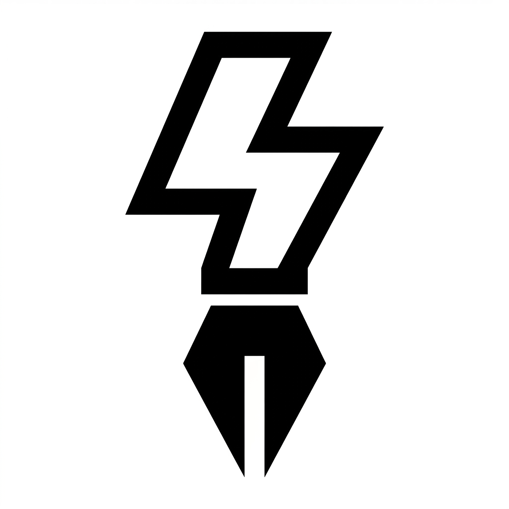

# Quick Input

A lightweight macOS menu bar app for quick-capturing notes to Notion with Markdown support.

<p align="center">
  
</p>

## Features

- **Menu bar app** — lives in the menu bar, no Dock icon clutter
- **Global hotkey** — summon the editor instantly from anywhere (default: `⌘⇧N`)
- **Markdown editor** — syntax-highlighted editing with real-time preview
- **Offline-first sync** — notes are saved locally first, then synced to Notion automatically
- **Auto-retry** — failed syncs retry automatically when the network comes back
- **Smart titles** — first-line `# Heading` becomes the Notion page title; otherwise uses a timestamp (`yyyy-MM-dd HH:mm`)
- **Launch at Login** — optional auto-start via macOS Login Items

## Installation

### Download DMG

Download the latest `QuickInput.dmg` from [Releases](../../releases), open it, and drag **Quick Input** to your Applications folder.

### Build from Source

Requires **Xcode 16+** and [XcodeGen](https://github.com/yonaskolb/XcodeGen):

```bash
brew install xcodegen

# Generate Xcode project and build
cd QuickInput && xcodegen generate
xcodebuild build -project QuickInput.xcodeproj -scheme QuickInput -configuration Debug

# Or build a DMG for distribution
./scripts/build-dmg.sh
```

## Quick Start — Notion Configuration

Quick Input sends notes to a Notion database via the Notion API. Follow these steps to set it up:

### 1. Create a Notion Integration

1. Go to [Notion Developers](https://www.notion.so/profile/integrations) and click **New integration**
2. Give it a name (e.g., "Quick Input")
3. Select the workspace where your notes will live
4. Under **Capabilities**, ensure **Insert content** is enabled
5. Click **Save**

### 2. Copy the Integration Token

On the integration page, click **Show** next to the Internal Integration Secret, then copy the token (it starts with `ntn_`).

### 3. Create a Database

Create a new **full-page database** in Notion (or use an existing one). The database only needs a **Title** property (which is included by default).

### 4. Connect the Integration to the Database

1. Open the database page in Notion
2. Click the **`···`** menu in the top-right corner
3. Go to **Connections → Connect to** and select your integration

### 5. Get the Database ID

Open the database in your browser. The URL looks like:

```
https://www.notion.so/<workspace>/<database-id>?v=...
```

The Database ID is the **32-character hex string** before the `?v=` parameter. Copy it (with or without dashes — both formats work).

### 6. Configure Quick Input

1. Click the Quick Input icon in the menu bar and open **Settings**
2. Paste your **API Token** into the token field
3. Paste your **Database ID** into the database ID field
4. Click **Test Connection** — you should see "✓ Connected successfully"

You're all set! Press `⌘⇧N` to open the editor and start capturing notes.

## Usage

| Action | How |
|---|---|
| Open editor | Press the global hotkey (default `⌘⇧N`) or click the menu bar icon |
| Submit note | Press `⌘↩` in the editor |
| Change hotkey | Settings → Shortcuts → click the hotkey field and press a new combo |
| Retry failed syncs | Failed notes are retried automatically on reconnect, or manually via the menu |

### Title Behavior

- If the first line of your note is a Markdown H1 heading (`# My Title`), it becomes the Notion page title
- Otherwise, the current date and time (`yyyy-MM-dd HH:mm`) is used as the title

## System Requirements

- **macOS 14.0** (Sonoma) or later
- **Accessibility permission** — required for the global hotkey to work system-wide. The app will prompt you to grant access in System Settings → Privacy & Security → Accessibility

## License

MIT
